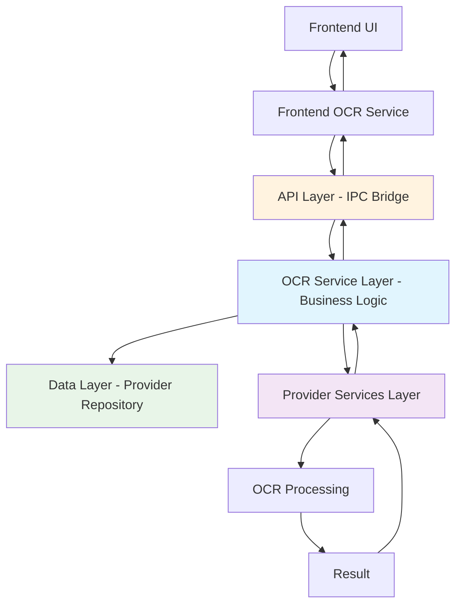

> [!NOTE]
> This technical documentation was automatically generated by Claude Code based on analysis of the current OCR implementation in the codebase. The content reflects the architecture as of the current branch state.

# OCR Architecture

## Overview

Cherry Studio's OCR (Optical Character Recognition) system is a modular, extensible architecture designed to support multiple OCR providers and file types. The architecture follows a layered approach with clear separation of concerns between data access, business logic, and provider implementations.

## Architecture Layers

The OCR architecture follows a layered approach where data interactions occur through RESTful APIs, while IPC serves as part of the API layer, allowing the renderer to interact directly with the business layer:

### 1. API Layer
**Location**: `src/main/data/api/handlers/`, `src/main/ipc.ts`, `src/preload/index.ts`

- **IPC Bridge**: Serves as API layer connecting renderer to main process
- **Request Routing**: Routes IPC calls to appropriate service methods
- **Type Safety**: Zod schemas for request/response validation
- **Error Handling**: Centralized error propagation across process boundaries
- **Security**: Secure communication sandbox between renderer and main processes

### 2. OCR Service Layer (Business Layer)
**Location**: `src/main/services/ocr/`

- **OcrService**: Main business logic orchestrator and central coordinator
- **Provider Registry**: Manages registered OCR providers
- **Data Integration**: Direct interaction with data layer for provider management
- **Lifecycle Management**: Handles provider initialization and disposal
- **Validation**: Ensures provider availability and data integrity
- **Orchestration**: Coordinates between providers and data services
- **Direct IPC Access**: Renderer can directly invoke business layer methods via IPC

### 3. Provider Services Layer
**Location**: `src/main/services/ocr/builtin/`

- **Base Service**: Abstract `OcrBaseService` defines common interface
- **Data Independence**: No direct database interactions, relies on injected data
- **Built-in Providers**:
  - `TesseractService`: Local Tesseract.js implementation
  - `SystemOcrService`: Platform-specific system OCR
  - `PpocrService`: PaddleOCR integration
  - `OvOcrService`: Intel OpenVINO (NPU) OCR
- **Pure OCR Logic**: Focus solely on OCR processing capabilities

### 4. Data Layer
**Location**: `src/main/data/db/schemas/ocr/`, `src/main/data/repositories/`

- **Database Schema**: Uses Drizzle ORM with SQLite database
- **Repository Pattern**: `OcrProviderRepository` handles all database operations
- **Provider Storage**: Stores provider configurations in `ocr_provider` table
- **JSON Configuration**: Polymorphic `config` field stores provider-specific settings
- **Data Access**: Exclusively accessed by OCR Service layer

### 5. Frontend Layer
**Location**: `src/renderer/src/services/ocr/`, `src/renderer/src/hooks/ocr/`

- **Direct IPC Communication**: Direct interaction with business layer via IPC
- **React Hooks**: Custom hooks for OCR operations and state management
- **Configuration UI**: Settings pages for provider configuration
- **State Management**: Frontend state synchronization with backend data

## Data Flow



**Key Flow Characteristics:**
- **Direct Business Access**: Frontend communicates directly with OCR Service layer via IPC
- **IPC as API Gateway**: IPC bridge functions as the API layer, handling routing and validation
- **Data Isolation**: Only business layer interacts with data persistence
- **Provider Independence**: OCR providers remain isolated from data concerns

## Provider System

### Provider Registration
- **Built-in Providers**: Automatically registered on service initialization
- **Custom Providers**: Support for extensible provider system
- **Configuration**: Each provider has its own configuration schema

### Provider Capabilities
```typescript
interface OcrProviderCapabilityRecord {
  image?: boolean    // Image file OCR support
  pdf?: boolean      // PDF file OCR support (future)
}
```

### Configuration Architecture
- **Polymorphic Config**: JSON-based configuration adapts to provider needs
- **Type Safety**: Zod schemas validate provider-specific configurations
- **Runtime Validation**: Configuration validation before OCR operations

## Type System

### Core Types
- **`OcrProvider`**: Base provider interface
- **`OcrParams`**: OCR operation parameters
- **`OcrResult`**: Standardized OCR result format
- **`SupportedOcrFile`**: File types supported for OCR

### Business Types
- **`OcrProviderBusiness`**: Domain-level provider representation
- **Operations**: Create, Update, Replace, Delete operations
- **Queries**: List providers with filtering options

### Provider-Specific Types
- **TesseractConfig**: Language selection, model paths
- **SystemOcrConfig**: Language preferences
- **PaddleOCRConfig**: API endpoints, authentication
- **OpenVINOConfig**: Device selection, model paths

## Built-in Providers

### Tesseract OCR
- **Engine**: Tesseract.js
- **Languages**: Multi-language support with automatic download
- **Configuration**: Language selection, cache management
- **Performance**: Worker pooling for concurrent processing

### System OCR
- **Windows**: Windows Media Foundation OCR
- **macOS**: Vision framework OCR
- **Linux**: Platform-specific implementations
- **Features**: Native performance, system integration

### PaddleOCR
- **Deployment**: Remote API integration
- **Languages**: Chinese, English, and mixed language support
- **Configuration**: API endpoints and authentication

### Intel OpenVINO OCR
- **Hardware**: NPU acceleration support
- **Performance**: Optimized for Intel hardware
- **Use Case**: High-performance OCR scenarios

## Configuration Management

### Database Schema
```sql
CREATE TABLE ocr_provider (
  id TEXT PRIMARY KEY,
  name TEXT NOT NULL,
  capabilities TEXT NOT NULL,  -- JSON
  config TEXT NOT NULL,        -- JSON
  created_at INTEGER NOT NULL,
  updated_at INTEGER NOT NULL
);
```

### Provider Defaults
- **Initial Configuration**: Defined in `packages/shared/config/ocr.ts`
- **Migration System**: Automatic provider initialization on startup
- **User Customization**: Runtime configuration updates

## Error Handling

### Error Categories
- **Provider Errors**: OCR engine failures, missing dependencies
- **Configuration Errors**: Invalid settings, missing parameters
- **File Errors**: Unsupported formats, corrupted files
- **System Errors**: Resource exhaustion, permissions

### Error Propagation
- **Logging**: Centralized logging with context
- **User Feedback**: Translated error messages
- **Recovery**: Graceful fallback options

## Performance Considerations

### Resource Management
- **Worker Disposal**: Proper cleanup of OCR workers
- **Memory Management**: Limits on file sizes and concurrent operations
- **Caching**: Model and result caching where applicable

### Optimization
- **Lazy Loading**: Providers initialized on demand
- **Concurrent Processing**: Multiple workers for parallel operations
- **Hardware Acceleration**: NPU and GPU support where available

## Security

### Input Validation
- **File Type Checking**: Strict validation of supported formats
- **Size Limits**: Protection against resource exhaustion
- **Path Validation**: Prevention of path traversal attacks

### Configuration Security
- **API Key Storage**: Secure storage of sensitive configuration
- **Validation**: Runtime validation of configuration parameters
- **Sandboxing**: Isolated execution of OCR operations

## Extension Points

### Custom Providers
- **Interface**: Implement `OcrBaseService` for new providers
- **Registration**: Dynamic provider registration system
- **Configuration**: Extensible configuration schemas

### File Type Support
- **Handlers**: Modular file type processors
- **Capabilities**: Declarative provider capabilities
- **Future Support**: PDF, document formats planned

## Migration Strategy

### Legacy System
- **Data Migration**: Automatic migration from old configuration formats
- **Compatibility**: Backward compatibility during transition
- **Testing**: Comprehensive test coverage for migration paths

### Future Enhancements
- **PDF Support**: Planned extension to document OCR
- **Cloud Providers**: API-based OCR services integration
- **AI Enhancement**: Post-processing and accuracy improvements

## Development Guidelines

### Adding New Providers
1. Create provider service extending `OcrBaseService`
2. Define provider-specific configuration schema
3. Register provider in `OcrService`
4. Add configuration UI components
5. Include comprehensive tests

> [!WARNING]
> Provider services should never directly access the data layer. All data operations must go through the OCR Service layer to maintain proper separation of concerns.

### Configuration Changes
1. Update provider configuration schema
2. Add migration logic for existing configurations
3. Update UI validation and error handling
4. Test with various configuration scenarios

> [!WARNING]
> Always validate configuration changes before saving to the database. Use Zod schemas for runtime validation to prevent corrupted provider configurations.

### Testing
- **Unit Tests**: Provider implementation testing
- **Integration Tests**: End-to-end OCR workflows
- **Performance Tests**: Resource usage and timing
- **Error Scenarios**: Comprehensive error handling testing