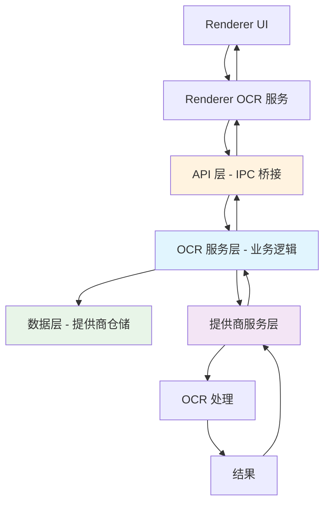

> [!NOTE]
> 本技术文档由 Claude Code 基于对当前代码库中 OCR 实现的分析自动生成。内容反映了当前分支状态的架构设计。

# OCR 架构文档

## 概述

Cherry Studio 的 OCR（光学字符识别）系统是一个模块化、可扩展的架构，旨在支持多个 OCR 提供商和文件类型。该架构采用分层设计，在数据访问、业务逻辑和提供商实现之间有明确的关注点分离。

## 架构分层

OCR 架构采用分层方法，其中数据交互通过 RESTful API 进行，而 IPC 作为 API 层的一部分，允许 Renderer 直接与业务层交互：

### 1. API 层
**位置**: `src/main/data/api/handlers/`, `src/main/ipc.ts`, `src/preload/index.ts`

- **IPC 桥接**: 作为 API 层连接 Renderer 到主进程
- **请求路由**: 将 IPC 调用路由到相应的服务方法
- **类型安全**: 使用 Zod 模式进行请求/响应验证
- **错误处理**: 跨进程边界的集中式错误传播
- **安全**: Renderer 和主进程之间的安全通信沙盒

### 2. OCR 服务层（业务层）
**位置**: `src/main/services/ocr/`

- **OcrService**: 主要业务逻辑协调器和中央协调器
- **提供商注册表**: 管理已注册的 OCR 提供商
- **数据集成**: 与数据层直接交互进行提供商管理
- **生命周期管理**: 处理提供商初始化和销毁
- **验证**: 确保提供商可用性和数据完整性
- **协调**: 协调提供商和数据服务之间的交互
- **直接 IPC 访问**: Renderer 可通过 IPC 直接调用业务层方法

### 3. 提供商服务层
**位置**: `src/main/services/ocr/builtin/`

- **基础服务**: 抽象的 `OcrBaseService` 定义通用接口
- **数据独立性**: 无直接数据库交互，依赖外部传入的数据
- **内置提供商**:
  - `TesseractService`: 本地 Tesseract.js 实现
  - `SystemOcrService`: 平台特定的系统 OCR
  - `PpocrService`: PaddleOCR 集成
  - `OvOcrService`: Intel OpenVINO (NPU) OCR
- **纯 OCR 逻辑**: 专注于 OCR 处理能力

### 4. 数据层
**位置**: `src/main/data/db/schemas/ocr/`, `src/main/data/repositories/`

- **数据库架构**: 使用 Drizzle ORM 和 SQLite 数据库
- **仓储模式**: `OcrProviderRepository` 处理所有数据库操作
- **提供商存储**: 在 `ocr_provider` 表中存储提供商配置
- **JSON 配置**: 多态的 `config` 字段存储提供商特定的设置
- **数据访问**: 仅由 OCR 服务层访问

### 5. Renderer 层
**位置**: `src/renderer/src/services/ocr/`, `src/renderer/src/hooks/ocr/`

- **直接 IPC 通信**: 通过 IPC 与业务层直接交互
- **React Hooks**: 用于 OCR 操作和状态管理的自定义钩子
- **配置 UI**: 提供商配置的设置页面
- **状态管理**: Renderer 状态与后端数据同步

## 数据流



**关键流程特征**:
- **直接业务访问**: Renderer 通过 IPC 与 OCR 服务层直接通信
- **IPC 作为 API 网关**: IPC 桥接作为 API 层，处理路由和验证
- **数据隔离**: 只有业务层与数据持久化交互
- **提供商独立性**: OCR 提供商保持与数据关注点的隔离

## 提供商系统

### 提供商注册
- **内置提供商**: 在服务初始化时自动注册
- **自定义提供商**: 支持可扩展的提供商系统
- **配置**: 每个提供商都有自己的配置模式

### 提供商能力
```typescript
interface OcrProviderCapabilityRecord {
  image?: boolean    // 图像文件 OCR 支持
  pdf?: boolean      // PDF 文件 OCR 支持（未来）
}
```

### 配置架构
- **多态配置**: 基于 JSON 的配置适应提供商需求
- **类型安全**: Zod 模式验证提供商特定的配置
- **运行时验证**: OCR 操作前的配置验证

## 类型系统

### 核心类型
- **`OcrProvider`**: 基础提供商接口
- **`OcrParams`**: OCR 操作参数
- **`OcrResult`**: 标准化的 OCR 结果格式
- **`SupportedOcrFile`**: 支持 OCR 的文件类型

### 业务类型
- **`OcrProviderBusiness`**: 域级别的提供商表示
- **操作**: 创建、更新、替换、删除操作
- **查询**: 带过滤选项的提供商列表

### 提供商特定类型
- **TesseractConfig**: 语言选择、模型路径
- **SystemOcrConfig**: 语言偏好
- **PaddleOCRConfig**: API 端点、认证
- **OpenVINOConfig**: 设备选择、模型路径

## 内置提供商

### Tesseract OCR
- **引擎**: Tesseract.js
- **语言**: 支持多语言，自动下载
- **配置**: 语言选择、缓存管理
- **性能**: 工作池用于并发处理

### 系统 OCR
- **Windows**: Windows Media Foundation OCR
- **macOS**: Vision 框架 OCR
- **Linux**: 平台特定实现
- **特性**: 原生性能、系统集成

### PaddleOCR
- **部署**: 远程 API 集成
- **语言**: 中文、英文和混合语言支持
- **配置**: API 端点和认证

### Intel OpenVINO OCR
- **硬件**: NPU 加速支持
- **性能**: 为 Intel 硬件优化
- **用例**: 高性能 OCR 场景

## 配置管理

### 数据库架构
```sql
CREATE TABLE ocr_provider (
  id TEXT PRIMARY KEY,
  name TEXT NOT NULL,
  capabilities TEXT NOT NULL,  -- JSON
  config TEXT NOT NULL,        -- JSON
  created_at INTEGER NOT NULL,
  updated_at INTEGER NOT NULL
);
```

### 提供商默认值
- **初始配置**: 在 `packages/shared/config/ocr.ts` 中定义
- **迁移系统**: 启动时自动提供商初始化
- **用户自定义**: 运行时配置更新

## 错误处理

### 错误类别
- **提供商错误**: OCR 引擎故障、缺少依赖
- **配置错误**: 无效设置、缺少参数
- **文件错误**: 不支持的格式、损坏的文件
- **系统错误**: 资源耗尽、权限问题

### 错误传播
- **日志**: 带上下文的集中日志记录
- **用户反馈**: 翻译的错误消息
- **恢复**: 优雅的回退选项

## 性能考虑

### 资源管理
- **工作器销毁**: OCR 工作器的适当清理
- **内存管理**: 文件大小和并发操作限制
- **缓存**: 模型和结果缓存（如适用）

### 优化
- **延迟加载**: 按需初始化提供商
- **并发处理**: 多工作器用于并行操作
- **硬件加速**: NPU 和 GPU 支持（如可用）

## 安全

### 输入验证
- **文件类型检查**: 严格验证支持的格式
- **大小限制**: 防止资源耗尽
- **路径验证**: 防止路径遍历攻击

### 配置安全
- **API 密钥存储**: 敏感配置的安全存储
- **验证**: 配置参数的运行时验证
- **沙盒**: OCR 操作的隔离执行

## 扩展点

### 自定义提供商
- **接口**: 为新提供商实现 `OcrBaseService`
- **注册**: 动态提供商注册系统
- **配置**: 可扩展的配置模式

### 文件类型支持
- **处理器**: 模块化文件类型处理器
- **能力**: 声明式提供商能力
- **未来支持**: PDF、文档格式计划中

## 迁移策略

### 遗留系统
- **数据迁移**: 从旧配置格式自动迁移
- **兼容性**: 过渡期间的向后兼容性
- **测试**: 迁移路径的全面测试覆盖

### 未来增强
- **PDF 支持**: 计划扩展到文档 OCR
- **云提供商**: 基于 API 的 OCR 服务集成
- **AI 增强**: 后处理和准确性改进

## 开发指南

### 添加新提供商
1. 创建扩展 `OcrBaseService` 的提供商服务
2. 定义提供商特定的配置模式
3. 在 `OcrService` 中注册提供商
4. 添加配置 UI 组件
5. 包含全面的测试

> [!WARNING]
> 提供商服务绝不应直接访问数据层。所有数据操作必须通过 OCR 服务层进行，以保持适当的关注点分离。

### 配置更改
1. 更新提供商配置模式
2. 为现有配置添加迁移逻辑
3. 更新 UI 验证和错误处理
4. 测试各种配置场景

> [!WARNING]
> 在保存到数据库之前，务必验证配置更改。使用 Zod 模式进行运行时验证，防止提供商配置损坏。

### 测试
- **单元测试**: 提供商实现测试
- **集成测试**: 端到端 OCR 工作流
- **性能测试**: 资源使用和时间
- **错误场景**: 全面的错误处理测试
